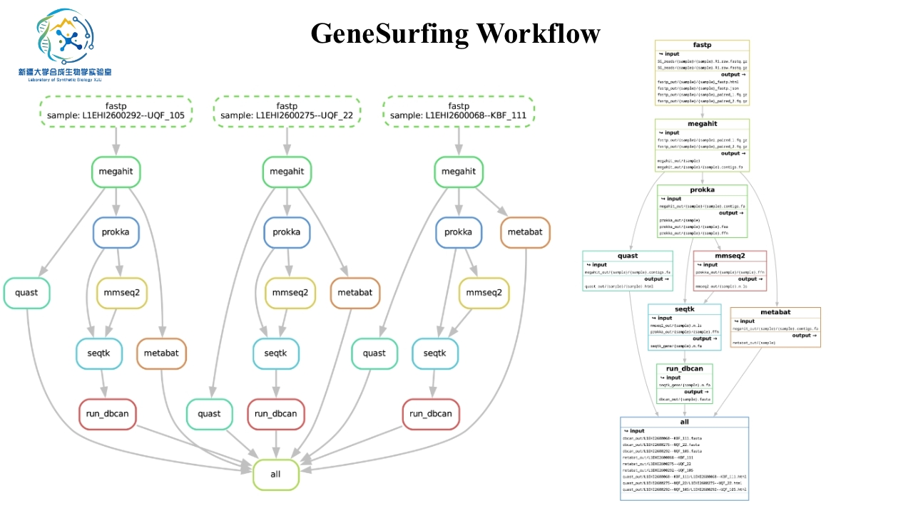

# GeneSurfing
Gene Surfing 是用于定向挖掘微生物基因组的功能基因生物信息工作流程，由新疆大学合成生物学实验室基于<u>snakemake</u>开发。方法学内容以及湿实验验证工作即将发表。



## GeneSurfing的安装

以下步骤介绍如何正确安装使用GeneSurfing。

### Step 1：仓库的克隆

在计算机或计算机集群上打开命令行界面（CLI）或终端。切换到要安装GeneSurfing的目录。然后，运行以下命令从GitHub克隆本仓库：

```bash
git clone https://github.com/XT33KAKA/GeneSurfing.git
```

### Step 2:  安装依赖项

* Conda (package manager)

* Snakemake v.6.17.1 or higher (workflow manager)

  **其他事项：**

- 为了运行Gene Surfing，需要Conda和snakemakake。

- Miniconda可以按照[Miniconda文档]（https://docs.conda.io/en/latest/miniconda.html）中的系统说明安装。

- 安装Miniconda后，可以按照[Snakemake文档]（https://snakemake.readthedocs.io/en/stable/getting_started/installation.html）中的说明安装Snakemake。当流程通过Conda环境运行时，Gene Surfingl将处理其他依赖项。

## GeneSurfing工作流程示意
