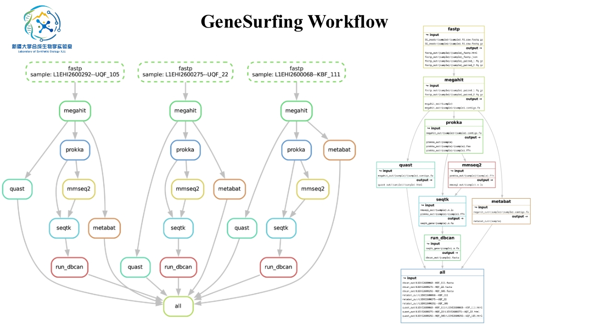

# GeneSurfing

## 📖 Project Overview

**GeneSurfing** is an efficient and universal tool for the directed mining of microbial metagenomic enzymes,according to the query sequence submitted by the user, the corresponding enzymes in the metagenome were mined.



- **Data Preprocessing**: Quality control with `fastp`  
- **Assembly**: Contig construction via `MEGAHIT`  
- **Quality Assessment**: Assembly evaluation using `QUAST`  
- **Functional Annotation**: Gene prediction with `Prokka`  
- **Sequence Retrieval**: Homology search through `MMseqs2`  

Featuring modular architecture and containerized environments, GeneSurfing ensures:  
✅ **End-to-end automation** from raw sequencing data to functional insights  
✅ **Reproducible results** across computing environments  
✅ **Scalable workflows** for large-scale datasets  
✅ **Standardized outputs** compatible with downstream analyses  


## 🛠️ Installation Requirements

### Required Software

- [Python ≥3.8](https://www.python.org/downloads/)
- [Snakemake ≥7.0](https://snakemake.readthedocs.io/)
- [Mamba](https://docs.conda.io/en/latest/miniconda.html)

### Environment Setup

```bash
# Clone the repository
git clone https://github.com/XT33KAKA/genesurfing.git
cd genesurfing
```

```bash
# Create a conda environment (optional)
conda create -n genesurfing python=3.8
conda activate genesurfing
```


## 🚀 Quick Start

### Input File Requirements

- `query.fasta`: Query sequence file (required)

- Sample directory structure:

- ```
  samples/
  ├── sample1/
  │   ├── sample1.R1.raw.fastq.gz
  │   └── sample1.R2.raw.fastq.gz
  ├── sample2/
  │   ├── sample2.R1.raw.fastq.gz
  │   └── sample2.R2.raw.fastq.gz
  ```

  ### Running the Pipeline

  ```bash
  # Basic run (using the default 1 thread)
  ./run_GS.py -q query.fasta -s samples/
  
  # Using multiple threads (recommended)
  ./run_GS.py -q query.fasta -s samples/ -c 8
  
  # Cluster mode (example)
  snakemake --profile slurm --config query_path=query.fasta samples_path=samples/
  ```

  ## ⚙️ Parameter Description

  | Parameter   | Abbreviation | Required | Default | Description                   |
  | ----------- | ------------ | -------- | ------- | ----------------------------- |
  | `--query`   | `-q`         | Yes      | None    | Path to the query FASTA file  |
  | `--samples` | `-s`         | Yes      | None    | Path to the samples directory |
  | `--cores`   | `-c`         | No       | 1       | Number of CPU cores to use    |

  ## 📂 Output Directory Structure

  ```
  results/
  ├── 1.fastp_out/            # Quality controlled data
  ├── 2.assembly/            # Assembly results
  ├── 3.assembly_assessment/  # Assembly quality assessment
  ├── 4.Gene_prokka_annote/   # Gene annotation
  ├── 5.MMSEQS2_Align_file/   # Sequence alignment results
  └── 6.Sequence_get/         # Extracted target sequences
      ├── Extracted_DNA_Sequences
      ├── Extracted_Protein_Sequences
      └── Extracted_Sequence_IDs
  ```

## ⚠️ Common Issues

**Q1: `MissingInputException` error occurs**
✅ Check if the sample directory structure meets the requirements and ensure the file names are formatted as `{sample}.R1.raw.fastq.gz`.

**Q2: Conda environment creation fails**
✅ Try using Mamba to speed up dependency resolution:

```bash
conda install -n base -c conda-forge mamba
mamba env create -f envs/environment.yaml
```


## 📄 License

This project is licensed under the [MIT License](https://xstech.one/LICENSE).

## 📧 Contact Us

For inquiries, please contact:
[](mailto:xt33kaka@163.com)
